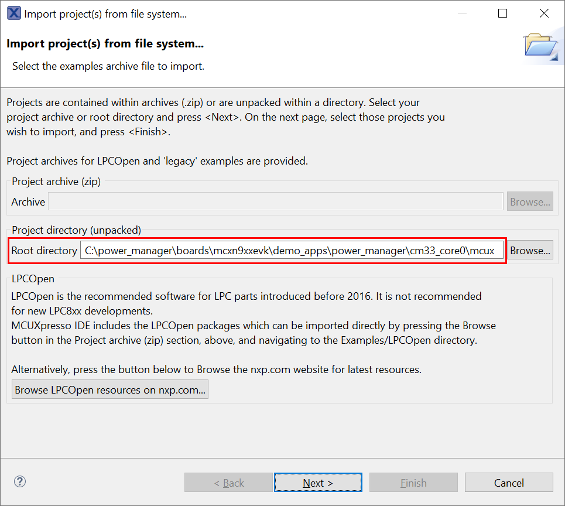
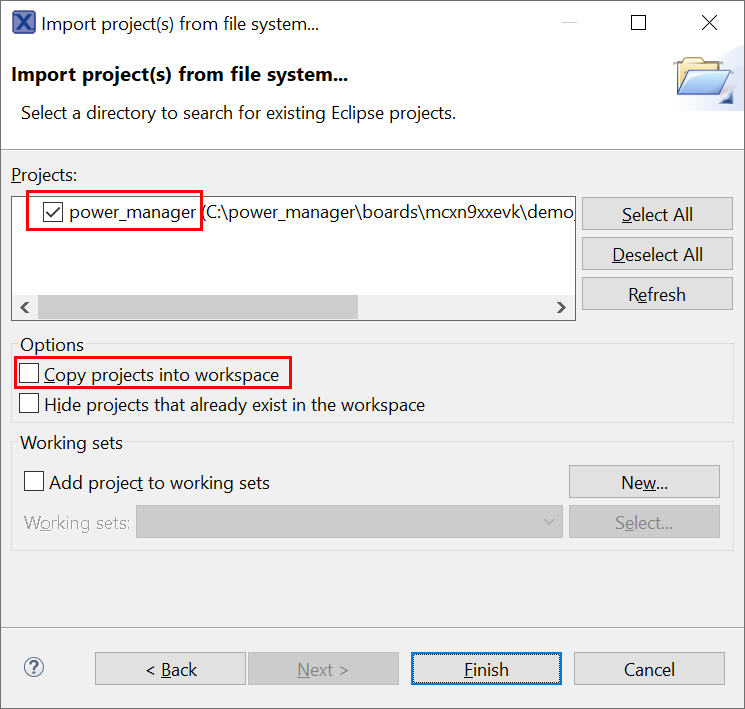
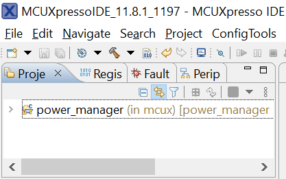
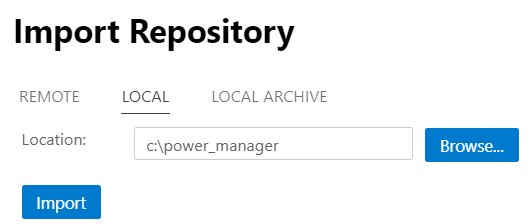
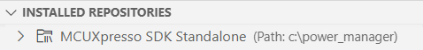
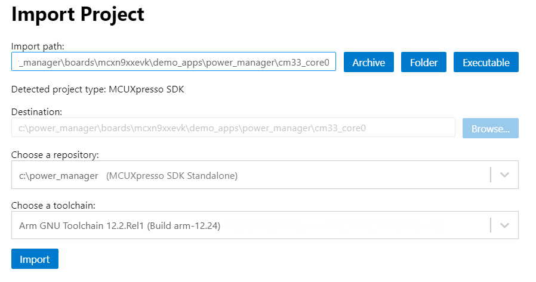
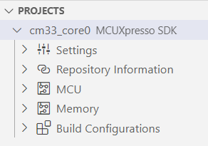

# NXP Application Code Hub
[](https://www.nxp.com)

## MCXN94x power manager training lab
The Power Manager example uses runtime menus to evaluate the power modes and power management features of the MCX Nx4x.  This example also uses the Power Manager component of MCUXpresso SDK, which provides a common framework of APIs for power management. For more details how to use this example and measure current, refer to the lab guide "MCXNx4x Power Management Lab.pdf".

In this lab, you will learn:
- about the Power Management features of the MCX Nx4x MCU
- how to measure current on the FRDM-MCXN947 board
- how to measure current with MCU-Link Pro and MCUXpresso IDE
- about the Power Management component in the MCUXpresso SDK

#### Boards: FRDM-MCXN947, MCX-N9XX-EVK
#### Categories: Low Power
#### Peripherals: CLOCKS
#### Toolchains: MCUXpresso IDE, IAR, VS Code

## Table of Contents
1. [Software](#step1)
2. [Hardware](#step2)
3. [Setup](#step3)
4. [Results](#step4)
5. [FAQs](#step5) 
6. [Support](#step6)
7. [Release Notes](#step7)

## 1. Software<a name="step1"></a>
- [MCUXpresso IDE](https://nxp.com/mcuxpresso) 11.8.1
- [MCUXpresso for VS Code](https://github.com/nxp-mcuxpresso/vscode-for-mcux/wiki) v1.4.63 or later
- [IAR Embedded Workbench](https://www.iar.com/products/architectures/arm/iar-embedded-workbench-for-arm/) 9.40.2

## 2. Hardware<a name="step2"></a>
- FRDM-MCXN947 board with USB Type-C cable
- or MCX-N9XX-EVK board with micro USB cable
- Personal Computer

## 3. Setup<a name="step3"></a>
The steps below detail how to import the example application into the 3 IDE options:

1) Clone the repo or extract the project archive.  In this example, the repo is cloned to `C:\power_manager`

The project defaults to the FRDM-MCXN947 board.  To build for a different board, change the `BOARD_NAME` macro in `board.h`.

### 3.1 Importing into MCUXpresso IDE
2) In the IDE's Quickstart panel, click **Import project(s) from filesystem**
3) Browse to the **Root Directory**, at `\boards\mcxn9xxevk\demo_apps\power_manager\cm33_core0\mcux`
  
4) Import the **power_manager** project, and uncheck the box **Copy projects into workspace**.  Then click Finish.
  
5) The power_manager project is now included in the Project Explorer view, and is ready to build.
  

### 3.2 Importing into VS Code
Using VS Code requires the MCUXpresso extension.  For details using this extension, see this [wiki](https://github.com/nxp-mcuxpresso/vscode-for-mcux/wiki).
2) In the MCUXpresso extension view, in the Quickstart Panel, click **Import Repository**.
3) Choose the **Local** repo option, and import the local folder used in [Setup](#step3).
  
  This MCUXpresso SDK Standalone repo will now be listed in the Installed Repositories view:
  
4) In the Quickstart Panel, click **Import Project**.
5) Click the **Folder** button, and browse to the application directory `\boards\mcxn9xxevk\demo_apps\power_manager\cm33_core0`.  Choose the **repository** imported in [Setup](#step3).  Choose the toolchain installed for VS Code.
  
  The project named `cm33_core0` will now be listed in the Projects view, and is ready to build.
  

### 3.3 Importing into IAR
2) Use the menu **File->Open Workspace**, and open the file `\boards\mcxn9xxevk\demo_apps\power_manager\cm33_core0\iar\power_manager.eww`

### 3.4 Connect the board
On the board, connect the USB cable between the PC host and the MCU-Link USB port on the board
- On the FRDM-MCXN947 board, connect to USB J17
- On the MCX-N9XX-EVK board, connect to USB J5

### 3.5 Connect a serial terminal
Open a serial terminal with the following settings:
- 115200 baud rate
- 8 data bits
- No parity
- One stop bit
- No flow control

## 4. Results<a name="step4"></a>
Refer to the lab guide "MCXNx4x Power Management Lab.pdf" for detailed steps using the demo application.

The log below shows the output of the power manager example in the terminal window:
```
Sticky RESET sources:
Warm,   PIN,
#######    MCX Nx4x Power Manager component demo    #######

----------------------- Normal Boot -----------------------

Main Menu, press a key below:

        p: Power Modes Menu
        a: Analog Peripherals Menu
        c: Clocks Menu
        v: Voltage Menu
        s: System SRAM Menu
        e: Enter Selected Mode
```

## 5. Support<a name="step6"></a>
[community.nxp.com](https://community.nxp.com/)

#### Project Metadata
<!----- Boards ----->
[](https://github.com/search?q=org%3Anxp-appcodehub+FRDM-MCXN947+in%3Areadme&type=Repositories) [](https://github.com/search?q=org%3Anxp-appcodehub+MCX-N9XX-EVK+in%3Areadme&type=Repositories)

<!----- Categories ----->
[](https://github.com/search?q=org%3Anxp-appcodehub+low_power+in%3Areadme&type=Repositories)

<!----- Peripherals ----->
[](https://github.com/search?q=org%3Anxp-appcodehub+clocks+in%3Areadme&type=Repositories)

<!----- Toolchains ----->
[](https://github.com/search?q=org%3Anxp-appcodehub+mcux+in%3Areadme&type=Repositories) [](https://github.com/search?q=org%3Anxp-appcodehub+iar+in%3Areadme&type=Repositories) [](https://github.com/search?q=org%3Anxp-appcodehub+vscode+in%3Areadme&type=Repositories)

Questions regarding the content/correctness of this example can be entered as Issues within this GitHub repository.

>**Warning**: For more general technical questions regarding NXP Microcontrollers and the difference in expected funcionality, enter your questions on the [NXP Community Forum](https://community.nxp.com/)

[](https://www.youtube.com/@NXP_Semiconductors)
[](https://www.linkedin.com/company/nxp-semiconductors)
[](https://www.facebook.com/nxpsemi/)
[](https://twitter.com/NXP)

## 7. Release Notes<a name="step7"></a>
| Version | Description / Update                           | Date                        |
|:-------:|------------------------------------------------|----------------------------:|
| 1.0     | Initial release on Application Code Hub        | January 2<sup>nd</sup> 2024 |

